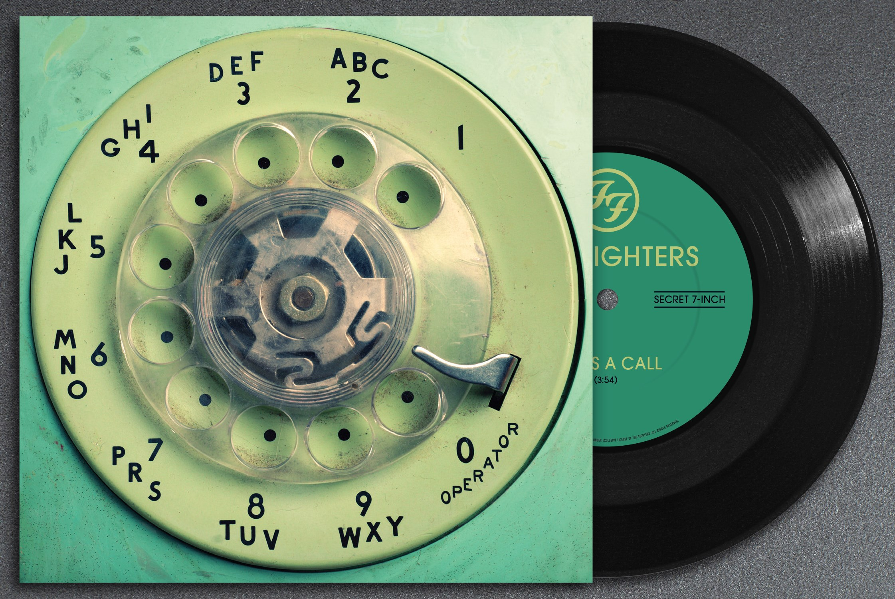
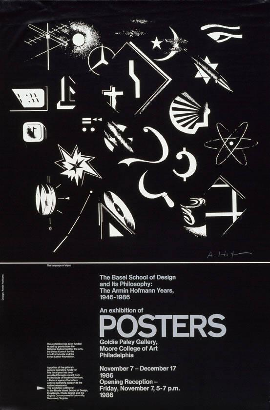
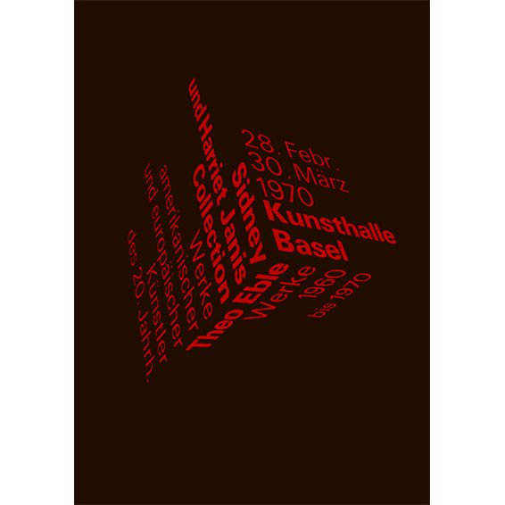
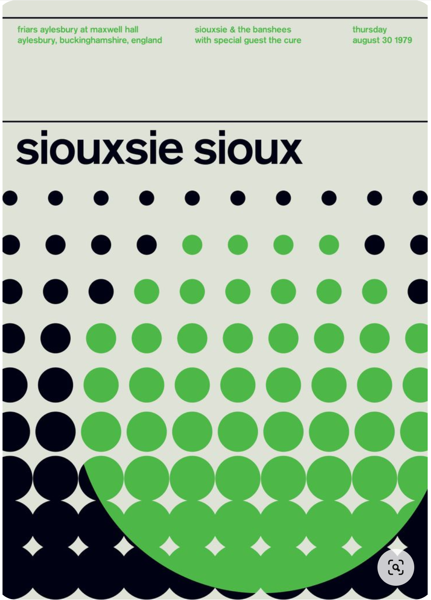
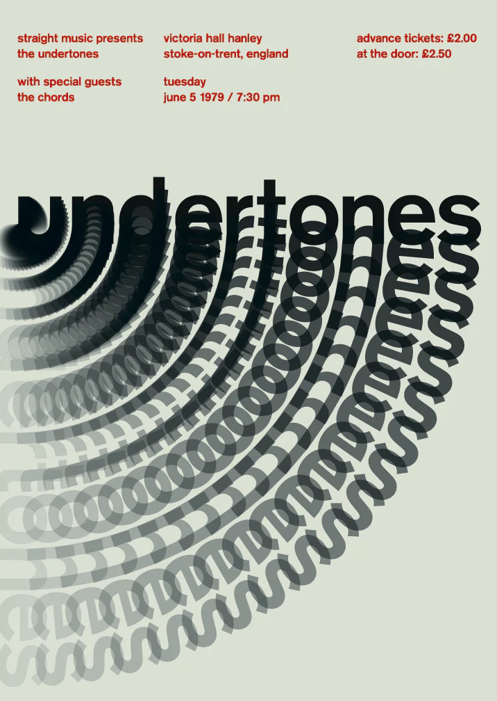
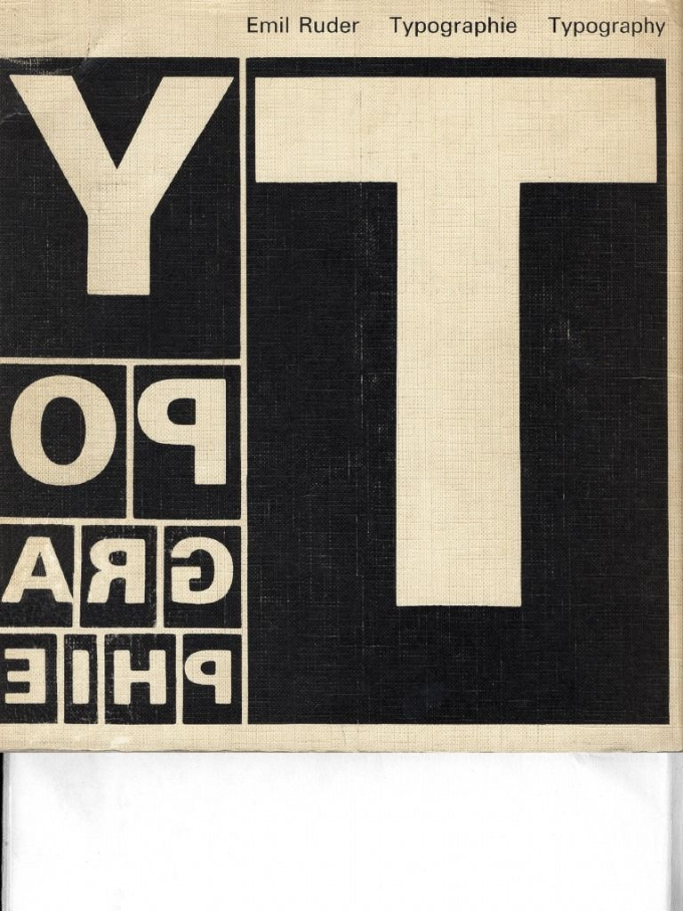
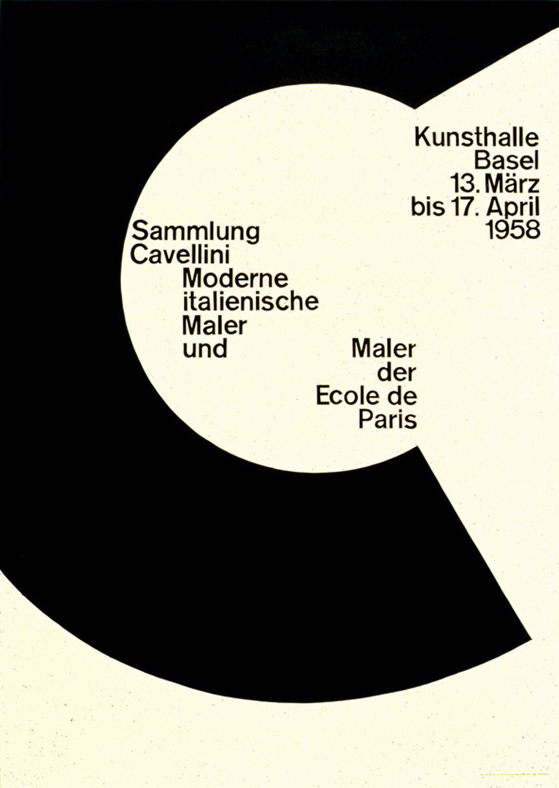

Diese Dokumentation zeigt meinen Arbeitsprozess bei der Entwicklung meines Semesterprojekts auf und bietet Einblicke in Herausforderungen, Erfolge und Fortschritte während des gesamten Moduls.

[Hier geht es direkt zum Semesterprojekt](v2_radiohead/){:target="_blank"}

# Auswahl Plakat
Zu Beginn des Moduls habe ich mir die verschiedenen Plakate angesehen und folgende für mich interessante herausgesucht:

 |  |  | 
------------ | ------------- | ------------- | -------------
 |  |  | 

Aus den 8 vorausgewählten Plakaten habe ich mich für folgendes Plakat für Radiohead entschieden:


# Umsetzung 1

[Zur Umsetzung 1](radiohead/){:target="_blank"}

## Planung & Vorarbeit
### Schrift
Bevor ich mit der Umsetzung startete, brauchte ich eine passende Schrift, um das Plakat umzusetzen. Die im Plakat verwendete Schrift ist nicht gratis verfügbar und ich habe mich somit für eine Alternative umgesehen. Nach ein paar Vergleichen, habe ich mich für die Schrift ["Roboto"](https://fonts.google.com/specimen/Roboto){:target="_blank"} entschieden. Diese konnte ich später mit Google Fonts sehr simpel einbinden.

### Konzept
Da im Web im Vergleich zum Originalplakat andere Dimensionen und Möglichkeiten existieren, passte ich das Aussehen und den Aufbau des Plakates etwas an. Mein Plakat wollte ich so adaptieren und umsetzen, dass die Website nur 100vh hoch ist und somit nicht scrollbar. Dadurch wird genau eine Bildschirmgrösse voll mit dem Nachbau des Plakats ausgefüllt. Bevor ich diese Idee in HTML & CSS umsetzt, habe ich diese in Figma kurz umgesetzt und getestet.

Zudem habe ich mir Gedenken dazu gemacht, wie sich das Plakat an die verschiedenen Bildschirmgrössen und Verhältnissen anpasst: Ich habe nun den roten Bandname mit den darüberliegenden Informationen ganz an den unteren Bildschirmrand geschoben und nur darüber die schwarzen Balken erstellt.

Für Animationen, Interaktionen und den detailliertem Mobileaufbau habe ich mich für keine meiner Ideen entschieden und ausgearbeitet, da ich zuerst den Grundaufbau erarbeitet wollte, um diesen im Anschluss weiter auszubauen.

### Github
Von Anfang an habe ich ein GitHub-Repository für das Modul erstellt, um sicherzustellen, dass der neuste Stand meines Codes stets auf allen Geräten verfügbar ist. Zudem habe ich jedoch ebenfalls einen Google Drive Ordner für weitere Inhalte wie die Dokumentation erstellt. Denn zuerst habe ich diese in Google Drive geschrieben, da ich sehr wenig Erfahrung mit GitHub habe und auch die verschiedenen Möglichkeiten nicht kenne. Im Verlauf des Moduls konnte ich mich auch etwas mehr mit GitHub auseinandersetzen und habe somit versucht, GitHub Pages zu verwenden und auch meine Seite direkt mit GitHub onlinezustellen.

## Erster Nachbau mit HTML & CSS
Für den Aufbau in HTML habe ich den Inhalt in zwei Teile unterteilt. Den Bereich mit dem Bandnamen sowie den Informationen am unteren Bildrand und die schwarzen Balken darüber. Zuerst habe ich den Bandnamen auf allen Gerätdimensionen mithilfe von "vw" über die gesamte Breite gestreckt und mit "position: absolute" am unteren Bildrand platziert. Auch den Abstand nach unten habe ich von der Breite abhängig gemacht, damit dieser visuell immer identisch wirkt. Im Anschluss habe ich mithilfe von "Flexbox" die drei Informationsblöcke wie auf dem Poster über dem Bandnamen verteilt. Hier war es eher schwer, die richtigen Abstände und Breiten zu wählen, damit die Inhaltsblöcke auch bei unterschiedlichen Bildschirmbreiten so wie auf dem Plakat aussehen. Die Schwierigkeit kam davon, dass der Bandname mit der Breite mitskaliert, die Schriftgrösse der Informationen jedoch nicht, damit diese auf jeder Breite lesbar sind.

Neben den genannten Positionierungen habe ich in CSS ebenfalls die Schriftfamilie, Schriftschnitt, Schriftfarbe, Hintergrundfarben und Browserrests definiert.

## Adaptive generierung der Balken mit JavaScript
Ich wollte, dass die schwarzen Balken über den gesamten freien Bereich über dem Textblock verlaufen. Alle Balken sollten ca. so breit wie auf dem Plakat sein und wenn möglich dessen Breite auch nicht verändern. Da der obere Bereich je nach Fenstergrösse unterschiedlich hoch ist, bedeutet das, dass sich die Anzahl der Balken verändern muss, solange wie Höhe dieser und dessen Abstände zueinander statisch ist. Somit habe ich versucht, ein JavaScript-Code zu schreiben, welcher den freien oberen Bereich abmisst und mit den Balken auffüllt. Das stellte sich jedoch als viel komplexer heraus als gedacht, denn es tauchten laufend Fehler auf. Beispielsweise wurde aus verschiedenen Gründen teilweise der gesamte Body nach oben oder unten verschoben. Das spezielle daran war ebenfalls, dass diese Verschiebung oder auch andere Fehler nicht konsistent waren, sondern sich auch ohne Codeanpassung beim nächsten Neuladen etwas veränderten. Somit konnte das Problem auch mit entgegenwirkenden Abständen nicht behoben werden.

Aktuell werden die Balken nun wie folgt generiert:
- Um die Anzahl der Balken zu bestimmen, wird die Höhe der Fläche durch die optimale Balkenhöhe geteilt.
- Mit der berechneten Anzahl und der gesamten Höhe wird die effektive Höhe der Balken berechnet und in jedem Fall die gesamte Fläche zu füllen.
- Im letzten Schritt wir die berechnete Anzahl der Balken mit der berechneten Höhe erstellt und ins HTML eingefügt.

## Responsive
Da die Balken basierend auf den Bildschimdimensionen berechnet werden, müssen diese angepasst werden, sobald sich die Fenstergrösse verändert. Dadurch werden bei jeder Veränderung die Balken entfernt und neu generiert.

Die drei Informationsblöcke müssen sich ebenfalls auf schmaleren Geräten verändern, da diese ansonsten sehr zusammengedrückt werden und unleserlich sind. Für responsiv CSS Veränderungen habe ich 2 Breakpoints definiert:

Tablet:
`@media screen and (max-width: 991px)`

Mobile:
`@media screen and (max-width: 767px)`

Beim Wechsel auf Tabletgrössen wurden zum aktuellen Stand nur Abstände angepasst. Hingegen bei den Mobilegrössen wurden die Informationsblöcke übereinander statt zuvor nebeneinander angeordnet.

## Erste CSS Animationen
Schon von Beginn an war mir klar, dass ich die Breite der Balken animieren möchte. Für den Start habe ich mich entschieden, die Animationen mit CSS zu erstellen. Visuell wollte ich, dass sich wie beim Plakat die Balken nur rechts und links kürzen und in der Mitte fortlaufend stehen bleiben. Da sich die Anzahl der Balken verändert, konnte ich die Animationen nicht für alle Möglichkeiten durchplanen. Somit habe ich, um eine Varianz beizubehalten, 6 verschiedene Animationen erstellt, 3 welche den Balken auf der linken Seite kürzen und 3 auf der rechten.

Beispiel:
```
@keyframes bar1 {
  0%   {
    margin-left: -20%;
  }
  50%  {
    margin-left: -40%;
  }
  100% {
    margin-left: -20%;
  }
}
```

Diese Animationen werden nun während der Generierung der Balken zufällig zugewiesen, mit einer zufälligen Dauer von 3 - 6 Sekunden. So konnte ich relativ rasch und ohne ernsthafte Komplikationen einbinden, welche nun das Plakat stark aufwerten.

`div.style.animationName = "bar" + (Math.floor(Math.random() * 6) + 1);`

`div.style.animationDuration = (Math.floor(Math.random() * 4) + 3) + "s";`

Da es öfter als gedacht vorkam, dass mehrere Balken die exakt gleiche Animation und Dauer erhalten haben, habe ich nun die Anzahl der Animationen von gesamthaft 6 auf 10 erhöht. Somit sollte dieser Fall unwahrscheinlicher werden.

## Reaktiv zur Mauposition
Um die Website etwas spannender zu gestalten und eine gewisse Interaktion zu ermöglichen, wollte ich die Website reaktiv zu möglichen  Gerätesensoren verändern. Das Problem ist jedoch, dass die Endgeräte keine gemeinsamen Sensoren besitzen. Ein Tower PC hat beispielsweise sehr wenige oder andere Sensoren als ein Smartphone. Aus diesem Grund habe ich mich für den ersten Versuch auf die Mausposition beschränkt. Diese reaktive Interaktion, sollte im Anschluss mit möglichen Sensoren verbunden werden.

Um eine Tiefe in der Website zu schaffen, wollte ich die bereits Animierten Balken mit der Mausposition nach links oder nach rechts verschieben. Zu Beginn habe ich auspobiert, mit welchen CSS-Manipulationen ich einfach und zuverlässig die gewünschte Verschiebung umsetzen kann. Das war eine Herausforderung, da ich keine Verschiebung oder Abstand verwenden konnten, da die Balken auf beiden Seiten bis nach aussen kommen sollten. Nach verschiedenen Versuchen fand ich die Lösung bei "-Margin". Somit wird der Container der Balken versetzt und gleichzeitig um das verbreitert. Der nachteil liegt darin, dass ich für die eine Seite "margin-left" und für die Andere "margin-right" verwenden muss.

Mit JavaScript habe ich nun versucht die Mausposition in der Breite zu erkennen und auf eine Skala von -1 bis +1 zu übersetzen. Somit konnte ich bei negativen Werten, was eine mausposition auf der linken Seite bedeutet, ein "margin-left" setzen. Somit wird bei positiven Werden ein "margin-right" gesetzt. 

Leider habe ich es mit meinem Code nicht geschafft, ein "Easing" einzufügen. Um einen Sprung zu vermeiden, habe ich beim Verlassen der Maus von der Webiste folgenden Code erstellt. Dieser setzt die vorherigen Margins mit einer Transition von 0.3s auf 0 zurück. Leider konnte ich das Gleiche beim zurückkehren der Maus nicht umsetzten.

```
document.addEventListener('mouseleave', function(event) {
    let barContainer = document.getElementById("barsAnimate");
    barContainer.style.transition = "0.3s";
    barContainer.style.marginLeft = "0%";
    barContainer.style.marginRight = "0%";
});
```

## Überarbeitung Konzept
[Zum Figma-Konzept](https://www.figma.com/proto/Jf3XwwHms7cNMmfXE3pFYC/Untitled?type=design&node-id=15-2&t=LuxFAy5mCFoXrwBJ-1&scaling=min-zoom&starting-point-node-id=15%3A2&mode=design){:target="_blank"}

Bis jetzt habe ich das Plakat auf einer Bildschirmhöhe und -breite umgesetzt. Um mehr entdecken und erleben zu können, wollte ich mehr Inhalt erstellen und hauptsächlich die Website scrollbar machen. Somit habe ich damit begonnen, ein neues Konzept zu entwickeln.

Wie bereits beim ersten Konzept habe ich das Plakat mit dessen Eigenschaften analysiert und weiterentwickelt. Klare Eigenschaften sind:
- Die klaren breiten Rechtecke
- Der Bandname über die gesamte Breite.
- Der schwarzweise Farbstiel
- Die scheinbare horizontale Bewegung der Balken
- Die horizontal bewegte Visualisierung der Musik

<!--------------------------------------------------- NEW / uncorected --------------------------------------------------->

Klar war für mich, dass ich die Website über das im Plakat beworbene Konzert mache und somit nicht detailliert auf die Band eingehe. Da meine Website die Musik und dessen immersität zeigen sollte, um das interesse am Konzert zu wecken. Damit war für mich ebenfalls klar, dass ich die Musik der Band in der Website einbinde. Um die visuellen Eigenschaften vom Plakat aufzugreiffen, inludierte ich wie bei der ersten Umsetzung die schwarzen horizontalen Balken.

Schon im Voraus war mir bewusst, dass die Musik erst nach einer Interaktion des Benutzenden abgespielt werden kann und somit leider nicht bereits beim laden der Webiste. Dadurch war sicher, dass beim Einstieg eine ein Playbutton oder eine Musikauswahl erscheinen soll. Ich entschied mich für eine Musikauswahl in der Form von verschiedenen Schallplatten. Jede Schallplatte steht für einen spezifischen Song und kann durch einen Slider ausgewählt werden. Um eine Möglichkeit zum Wechselm des laufenden Songs zu bieten, wollte ich die aktive Schallplatte ab Bildschirmrand zeigen und rotieren lassen. Mit einem Klick auf diese, wir einem erneut die Übersicht aller Schallplatten gezeigt. Um die Musik auch wirklich zu erleben, habe ich das ganze so gestaltet, dass zu Beginn eine Schallplatte abgespielt werden muss, um auf den Inahlt der Seite zu gelangen. Nach dem ersten Input kann die Musik nicht mehr gestopt, sondern nur das Lied gewechselt werden. Ich wollte ebenfalls die Schallplatten mit der Maus drehbar machen, für ein authentischeres Gefühl sowie auch um die Seite und die Auswahl interessanter zu gestalten. 

Der Inahlt der Website sollte mit den schwarzen Blaken starten. Diese sollten sich mit der auktuell abgespielten Musik bewegen und diese viualisieren. Beim weiteren Scrollen werden nacheinander drei Ellipsen (verkürzte, grammatikalisch unvollständige Sätze) gezeigt und mit einer kleinen passenden Animation untermauert. Während dem Scrollen auf der Website sollten die Ellipsen in einer horizontalen Bewegung auf dem Bildschirm erschienen und ich in der Y-Koordinate nicht verändern. Beim weiterscrollen werden diese auf der X-Achse weiter verschoben sowie eine zum Text passende Animation wird abgespielt welche sich ebefalls eher horizontal bewegt. Bei denen Bewegungen bin ich mir nocht nicht sicher wie stark sich der eingelendte Text bewegen sollte und ob sich der Text und die Animation eher gegeneinander oder miteinander bewegen. Die Animationen sollten alle an die Scrollposition gebunden sein und somit mit der Scrollgeschwindigkeit vorwärts und rückwärts bewegen. Nach den drei Blöcken mit den Texten und Animationen erscheinen erneut die schwarzen Balken um zum Plakat zurückzukehren. Während diese auf dem Bildschrim ersichtlich sind wird voraussichtlich die Schallplatte auf der rechten Bildschrimseite mitgescrollt, um platz für den abschliessenden Inhalt zu schaffen. Denn zum Ende wird wie bei meiner ersten Umsetzung die Informationen und der Schriftzug "Radiohead" über die gesamte Breite dargestellt für eine klare und abschliessende Website.

Das entdecken der Website sollte angenehm, interessant und immersive sein. Das interesse der benutzende Person sollte geweckt werden und diese leiten. Für ein immersiveres und interessanters Erlebnis wollte ich den gesamten Inhalt der Website etwas verschieben. Diese Verschiebung sollte falls möglich aufgrund der Ausrichtung des Gerätes stattfinden. Falls das Gerät keinen solchen Sensor verbaut hat, sollte die Verschiebung aufgrund der Mausposition erfolgen. Um einen Form von Perspektive zu schaffen, wollte ich allenfalls verschiedene Objekte unterschiedlich stark verschieben. Zum Beispiel könnte die Schallplatte etwas mehr verschoben werden, da diese über dem gesamten Content liegt. 

Beim Konzet habe ich mich an den visuellen Elementen wie den Balken und den Texten orientiert. Zudem war mir die horizontale Bewegung sehr wichtig, ich habe versucht diese oft und passend in das Konzept einzuflechten und nicht mir einer vertikalen Bewegung zu stören. Der Auditive war ebenfalls relavant, wodurch der Audioplayer entstand. Die Informationen und der Bandname habe ich absichtlich erst am Ende der Webseite klar und gross platziert. Diese sollten von der benutzdenen Person entdekckt werden un diesen zuvor durch ein kleines Erlebnis führen, wie es auch das Konzert machen sollte.

# Unsetzung 2

[Zur Umsetzung 2](v2_radiohead/){:target="_blank"}

Ich habe mich dazu entschieden, die die zweite Umsetzung bzw. die Weiterentwicklung in einem neuen und leeren HTML-Dokument zu beginnen. Aus dem Grund, dass die zweite Umsetzung strukturell anders aufgebaut werden muss, als die Erste.

## Grundstruktur
Zu Beginn habe ich mir eine passende Grundstzuktur für meine HTML-Datei überlegt. Diese ist relevant um meine geplanten Ideen möglichst angenehm implementiere zu können. Wichtig waren hierbei die angedachte Bewegung der gesamten Inhalte basierend auf der Mausposition bzw. der Geräteneigung sowie der Audioplayer, welcher zu Beginn auf dem gesamten Bildschirm und danach an der rechten Bildschribseite ersichtlich ist. Mit diesen Gedanken erstellte ich folgende HTML-Struktur:

```
<body>
    <aside class="" id="audioplayer">

    </aside>
    <main>

    </main>
</body>
```

Mit folgendem CSS:

```
body {
    background-color: #d6d9c8;
    position: relative;
    overflow-x: hidden;
}
aside#audioplayer {
    position: absolute;
    top: 0;
    right: 0;
    width: 100%;
    height: 100vh;
    background-color: rgb(39, 39, 39);
    z-index: 10;
    overflow: hidden;
}
main {
    width: 80vw;
    padding-top: 50px;
    padding-left: 10vw;
}
```

Im Aside sollte der Audioplayer entstehen, welcher mit position absolut gewünscht platziert werden kann und somit auch zu Beginn über dem gesamten Inhalt mit voller Höhe und Breite stehen kann. Das Main-Tag dient als Container für den gesamten Inhalt welcher mit den spezifischen paddings und der fixen breite ebenfalls perfekt bewegt werden kann.

## Audioplayer
Nach dem Grundaufbau startete ich mit dem Audioplayer beim Seiteneinstieg in voller Bildschrimgrösse.

### Slider
Zu Beginn startete ich mit einem Slider mit welchem durch die Schallplatten gewechselt wird. Um diesen umzusetzen habe ich ein Sliderbeispiel genommen, bei welchem anhand von Buttons sowie per Touch zwischen den Slides gewechselt werden kann. Dieser Slider hatte jeodch einen fixen Start und ein fixes Ende und somit werden die Schallplatten nicht in einem Loop dargestellt. Das wollte ich ändern, und ich habe einige Zeit damit verbracht den Code umzuschreiben, damit ein Loop entsteht. Der eingefügte Code des Sliders funktioniert mit einem display flex Element welches horizontal verschoben wird. Unter anderem habe ich versucht Elemente zu duplizieren oder die Reihenfolge der Elemente zu verändern, um einen Loop zu symulieren. Dies hat jedoch grundlegende Probleme im Code verursacht. Nach längeren Versuchen habe ich eingesehen, dass dieses mit dem Basiscode des Sliders nicht funktionieren wird. Denn dieser ist ganz anders Aufgebaut. somit habe ich deiesen Versuch aufgegeben und den Slider auch ohne Loop belassen. 
 
Während des Aufbaus habe ich darauf geachtet, dass die Slides-Div problemlos um die eigene Achse rotierbar sind, da somit die rotierenden Schallplatten entstehen sollten. Schon zu Beginn habe ich mir überlegt wie ich das Bild der Schallplatte einfügen werde. Dazu habe ich ein Hintergrundbild mit der grösse "contain" verwendet. Da die SChallplatte normalerweise mit einem Boden des Schallplattenspielers rotiert wird, habe ich zusätzlich unter den Slider ein Div erstellt, welches später für diesen Boden verwendet werden kann.

### Rotation der Schallplatten
Die rotation der Schallplatten mit der Maus oder per Touch stellte sich als wesentlich anspruchsvoller und nervenaufreibender heraus als zuvor gedacht. Der Start funktionierte noch relativ angenehm. Ich konnte mit JavaScript die Elemente auswählen und spezifisch mit translate rotieren. Auch die Verbindung mit der Maus und dem Touch funktionierten relativ rasch. Wodurch die Platten manuell gedreht werden konnten. Der ersten Herausvorderung musste ich mich somit rasch stellen - dem neu setzen des Rotationsmittelpunktes. Da sich die Werte durch Screengrössenveränderungen und dem Slidwechsel dauernt veränderten, mussten diese stehts neu gesetzt werden. Diesen musste ich im richtigen moment setzen. Ich analysierte den Slider-Code erneut, um zu sehen wann sich welche Werte verändern um in diesem Moment der Ritationsmittelpunkt zu setzen. Etwas schwerer wurde es noch, als ich zudem bei jedem Slidewechsel die alte Schallplatte auf den 0-Punkt zurücksetzte. Das habe ich am Ende mit einer asynchronen FUnktion erstellt welche beim Wechsel aufgerufen wird, auf das Ende aller Touches und Mouseclicks wartet und zum Schluss die Schallplatte animiert zurücksetzen soll. Diese Animation konnte ich jedoch nicht mit css translate lösen und musste mit js erstellt werden. Wollte ich, dass sich die Schallplatte immer in dieselbe richtung dreht und unterschiedlich schnell, je nach Distanz welche rotiert werden muss.

### Rotation synchron mit der Musik
Die synchronisation der Schallplatten mit der Musik stellte sich als wesentlich anspruchsvoller und nervenaufreibender heraus als zuvor gedacht. Das Einfügen und Abspielen von AUdiodateien funkionierte problemlos. Auch die Erste Verbindung von Audio zu Schallplatte funkionierte zuverlässig. Das erste und Hauptproblem war nun, dass die länge der Audiodatei nur eine Rotation der Schallplatte abbildete. Ich habe nun in viele Stunden auf verschiedenste Arten versucht dieses Problem zu lösen. Relativ zu Beginn habe ich erkannt, dass durch das verbinden mit der Audio, viel Code von meinem scrubbing (das Bewegen der Schallplatte mit der Maus oder oer Touch) nicht mehr verwendet werden kann auch Teils auch nicht mehr benötigt wird. Die erste Herausvorderung war es, in einer Variable die aktuelle Rotation in mehr als 360 Grad zu speichern. Denn durch das Tracking der Maus position wurde das immer auf 0 zurückgesetzt. Ich startete damit, diese zurücksetzungen bzw. vollen Rotationen zu wählen und diesen als Multiplikator für die gesamte Rotation zu verwenden. 

Beispiel mit aktueller Rotation von 180 Grad und 4 vollen Drehungen:

`(360 * rotationCount) + currentAngle`

`(360 * 4) + 180`

Zu diesem Zeitpunkt wurde jedoch die Schallplatte noch mit einer Spanne von 0 bis 360 Grad bewegt. Um die Sprung von 360 zu 0 zu meistern ohne zurück zu drehen wurde eeine funktion verwendet um den kürzesten Weg zu berechnen und diese Rotation zu nehmen. 

Die noch grössere Herausvorderung stelle sich jedoch erst jetzt, als ein Maximum und Minimum an Rotation eingefügt werden sollte. Mir war hierbei wichtig, dass während des Scrubbings beim Erreichen des Starts und des Ende der Audio die Schallplatte stehen bleibt und nicht weiter dreht. Ein if-Statment einzufügen welches vor der Rotation die Werte prüft, war meine erste Idee. Hier war das Problem, dass im Hintergrund die Rotationen fortgesetzt wurden, was das zurückdrehen sehr unschön erscheinen lies. Ich wollte, dass die Schallplatte beim erreichen des Limits stehen bleibt. Während in diese Richtung gedreht wurd, passiert visuell nichts und auch die Werte im Hintergrund sollten unbeinflusst werden. Sobald eine Gegenrotaion ausgeführt wird, soll die Schallplatte sofort gedreht werden. Das zurücksetzen bzw. stehen lassen des Zählers der vollen Rotationen verursachte Probleme bei der Berechnung der aktuellen ROtation. Auch das Nicht-Aktualisieren der Rotationsposition funktionierte nicht, da somit die Refferenz für die nächste Rotationsdifferenz fehlte. Auch mit einer weiteren Variable löste sich das Problem nicht, denn mensch müsste mit der Maus bis zur entsprechenden Position zurück fahren, um die Schallplatte aufzugreiffen. Da die Schallplatte z.B. nur bis 4 Rotationen und 180 Grad fährt. falls ich nun bei 360 Grad mit der Maus umkehren würde, müsste ich bis 180 zurück rotieren, bis der Wert der Mausposition kleiner wird als die der Schallplatte. Dieses verhalten wollte ich umbedingt vermeiden. Die Schallplatte sollte direkt zurückgedreht werden. Da wurde es mir klar, es reicht nicht, die aktuelle Mausrotation und die vorherige Mausrotation für eine Differenz abzufragen. Ich musste unabhängig von der Rotation und jeglichen Limits, die Differenz der vorherigen und aktuellen Mausposition berechnen und separat abspeiuchern. Sobald die aktuelle Rotation + diese Differenz zu gross bzw. zu klein wird, darf die Schallplatte nicht bewegt werden. 

In diesem Abschnitt wird bei jeder Bewegung des Scrubbings die Differenz des Winkels (angleDiffrence) berechnet:

```
let mouseAngle;
let angleDiffrence;
if (event.type === 'touchmove') {
    let touch = event.touches[0];
    mouseAngle = ((Math.atan2(touch.clientY - centerY, touch.clientX - centerX) * 180 / Math.PI + 90) + 360) % 360;
} else {
    mouseAngle = ((Math.atan2(event.clientY - centerY, event.clientX - centerX) * 180 / Math.PI + 90) + 360) % 360;
}
if (mouseAngle - scrubbMove < -180) {
    scrubbMove -= 360;
} else if (mouseAngle - scrubbMove > 180) {
    scrubbMove += 360;
}
angleDiffrence = mouseAngle - scrubbMove;
scrubbMove += angleDiffrence;
```

Nach der erfolgreichen Berechung wird der Winkel der Schallplatte sowie die Zeit der Audio angepasst:

```
scrubber.style.transform = `rotate(${scrubbAngle + initialScrubberAngle}deg)`;
audio.currentTime = (scrubbAngle + initialScrubberAngle) / 360 * secondsPerRotate;
```

Während des erstellen des Codes musste ich stehts darauf acht geben, an den richtigen Stellen die Audio zu pausieren oder abspielen zu lassen. Beispielweise beim Wechsel der Schallplatten: Es wird wird geprüft ob die letzte Schallplatte abgespielt wurde oder nicht. Falls ja, wird die neue ebenfalls automatisch abgespielt:

```
wasPlaying ? audio.play() : null;
```

Wenn eine Schallplatte zuende Abgespielt wurde, wird der Slider ausgelöst, die Schallplatte gewechselt und automatisch abgespielt. Falls die letzte Schallplatte zu ende gespielt wurde, wird auf die Erste gewechselt:

```
function audioEnded() {
  // start next song / if last -> go to first
  if (currentIndex < slides.length - 1) {
      animateRotation(slides[currentIndex]);
      currentIndex += 1;
      setPositionByIndex();
      updateScrubberCenter();
      initialAudio();
  } else {
      animateRotation(slides[currentIndex]);
      currentIndex = 0;
      setPositionByIndex();
      updateScrubberCenter();
      initialAudio();
  }
}
```

Natürlich muss auch während des abspielens der Audio die Schallplatte gedreht werden:

```
function updateScrubber() {
  scrubber.style.transform = `rotate(${(360 / secondsPerRotate) * audio.currentTime}deg)`;
  if (!audio.paused && !audio.ended) {
      requestAnimationFrame(updateScrubber);
  }
}
```

### Minimierung
Nach meinem Konzept wollte ich, dass durch die Schallplatten geschaut werden kann und ein Song angeklickt und somit abgespielt werden kann. Durch das Abspielen verkleinert sich die Auswahl und es ist nur noch die aktuelle Schallplatte am Festerrand ersichtlich. Mit einem Klick auf diese kann die Auswahl geöffnet und einen neuen Song gewählt werden. Durch meine Grundstruktur habe ich bereits den Audioplayer mit der Schallplattenauswahl absolut nach dem rechten Bildschirmrand platziert. Nun musste nur auf eine eher umständliche Art einen normalen Klick (kein Scrubbing) erkannt werden. Dadurch wird eine CSS-Klasse (audioplayer-close) dem PLayer hinzugefügt welche wenige CSS-Anpassungen vornimmt. Durch einen erneuten klick beim minimierten Player werden die CSS-Anpassungen entfernt:

```
function openPlayer(event) {
  event.preventDefault();
  let clickStartPosition = [], clickEndPosition = [];
  if (event.type === 'touchstart') {
    let touch = event.touches[0];
    clickStartPosition = [touch.clientX, touch.clientY];
    document.addEventListener('touchend', clickEnd);
  } else {
    clickStartPosition = [event.clientX, event.clientY];
    document.addEventListener('mouseup', clickEnd);
  }
  function clickEnd (event) {
    if (event.type === 'touchend') {
      let touch = event.changedTouches[0];
      clickEndPosition = [touch.clientX, touch.clientY];
      document.removeEventListener('touchend', clickEnd);
    } else {
      clickEndPosition = [event.clientX, event.clientY];
      document.removeEventListener('mouseup', clickEnd);
    }
    if (Math.abs(clickStartPosition[0] - clickEndPosition[0]) <= 2 && Math.abs(clickStartPosition[1] - clickEndPosition[1]) <= 2) {
      if (audioplayer.classList.contains('audioplayer-close')) {
        audioplayer.classList.remove('audioplayer-close');
      } else {
        audioplayer.classList.add('audioplayer-close');
      }
    }
  }
}
```

```
aside#audioplayer.audioplayer-close {
  width: calc(15vw + 10px);
  background-color: initial;
}
aside#audioplayer.audioplayer-close #slide-background {
  left: 0;
}
aside#audioplayer.audioplayer-close .slider-container {
  padding-left: 10px;
}
aside#audioplayer.audioplayer-close .arrow {
  opacity: 0;
}
```

Hier gibt es noch kleine Punkte welche noch nicht behoben wurden, bevor ich zum nächsten Schritt gegangen bin. Beispielsweise funktioniert das Scrubbing im Minimierten Player noch nicht wie gewünscht, da das Zentrum nicht korrekt ist oder auch der Schallplattenwechsel sollte noch eine spezifische Animation für die minimierte Ansicht erhalten.

### Hovertext
Um den Audioplayer verständlicher zu machen, wollte ich einen Text bei der Maus einfügen welcher beispielsweise "play" zeigt. Hierfür habe ich ein div erstellt welches für soche Texte verwendet werden kann. in einer Funktion wird zuerst zwischen den möglichen Texten differenziert. Anschliessend wird der Text zu der Mausposition verschoben und zum Schluss der funktion wird das ein- und ausblenden des Textes gesteuert. Hierbei war eine Herausforderung das verzögerte Ausblanden. Wenn die Schallplatte verlassend wird, wird mit einer Verzögerung von 0.3s der Text ausgeblendet. Somit kann per CSS die Deckkraft in dieser Zeit reduziert werden. Das Problem hierbei war, falls in den 0.3s die Maus erneut über die Schallplatte fährt, wird der Text trotzdem ausgeblendet. Zuerst versucht ich das Problem mit `clearTimeout(hideTextTimeout);` zu lösen, jedoch hat das aus unerklährlichen gründen nicht geklappt. Nun habe ich eine zusaätzliche Varable erstellt, welche das Problem löst.

```
let hoverTextElement = document.getElementById("hoverText");
let hoverTextAudioPLayed = false;
let hideTextTimeout = null;
let hotfixStopClear = false;
function hoverText (event) {
    hotfixStopClear = true;
    if (audioplayer.classList.contains('audioplayer-close')) {
        hoverTextElement.innerHTML = "open";
    } else {
        if (hoverTextAudioPLayed) {
            hoverTextElement.innerHTML = "scrubb me!";
        } else {
            hoverTextElement.innerHTML = "play";
        }
    }
    updatePosition(event);
    hoverTextElement.style.display = "block";
    hoverTextElement.style.opacity = "1";
    document.addEventListener('mousemove', updatePosition);
    event.target.addEventListener('mouseleave', () => {
        hoverTextElement.style.opacity = "0";
        hotfixStopClear = false;
        hideTextTimeout = setTimeout(function() {
            if (!hotfixStopClear) {
                document.removeEventListener('mousemove', updatePosition);
                hoverTextElement.style.display = "none";
            }
        }, 300);
    });
    function updatePosition (event) {
        let x = event.clientX;
        let y = event.clientY;
        hoverTextElement.style.left = x + "px";
        hoverTextElement.style.top = y + 30 + "px";
    }
}
```

## Visualisierung der Audio
Schon im Vorfeld habe ich hierzu die Umsetzbarkeit angeschaut und geprüft. 

## überarbeitung Konzept
Nach der Besprechung am 26.03.2024 mit Hanna Züllig und ihrem Feedback habe ich mir erneut gedanken zu meinem Konzept gemacht um die Wirkung zu optimieren. 
- Aufgrund der Funktion mit der Verschiebung des Inhalt habe ich, im Gegensatz zur ersten Version, einen Abstand vom Bildschrimrand zum Inahlt erstellt. Dieser Abstand diente dazu, dass der Inhalt verschoben werden konnte, jedoch dieser nicht abgeschnitten wurde. Die Website verlohr durch diesen ABstand jedoch an Wirkung. Dieser Abstand soll nun entfernt werde. Somit wird ebenfalls die dazugehörige Funktion entfernt.
- Wie bei der ersten Version und auch dem Plakat, soll der Inhalt den gesamten Platz ausfüllen. Dadurch soll auch die Schallplatte am Seitenrand entfernt werden. Der Player wird nun in die Seite eingebaut, anstatt in einem Popup über der Website zu schweben.


<!---
[Link in new Tab](radiohead/){:target="_blank"}
-->